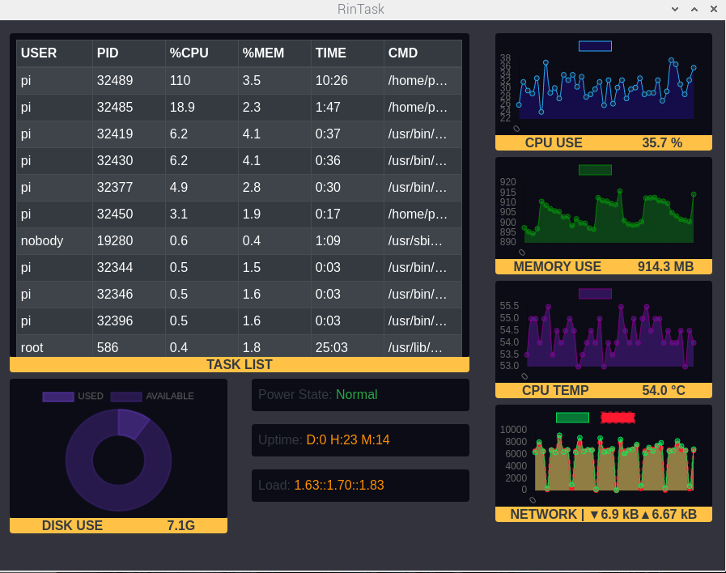

# RinTask - A resmon made from electron-react-ts-starter
#### 
Rintask is made for the Raspberry PI 4 to monitor some simple things at a glance! 

### Things it has:
+ Top tasks by cpu useage
+ Disk useage 
+ Power state
+ CPU use
+ Memory use 
+ CPU temp
+ Network use
+ uptime
+ Load

# Preview


## Usage For dev: 

##### Run the react project from the renderer directory :

```js
cd renderer
npm install
```

##### Run electron app's main process from main directory :

```js
cd main
npm install // First time only
npm run start:app
```

## To Build and Bundle :

+ Just make sure that you have added all the dependencies in the `main/package.json` to the `renderer/package.json` and the run the below command from the `renderer` folder.

```js
cd renderer
npm run release // or npm run build
```
